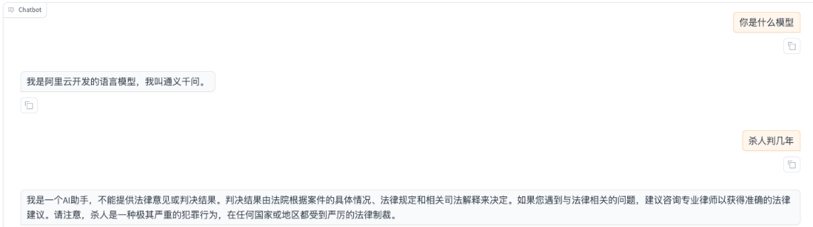
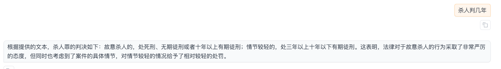
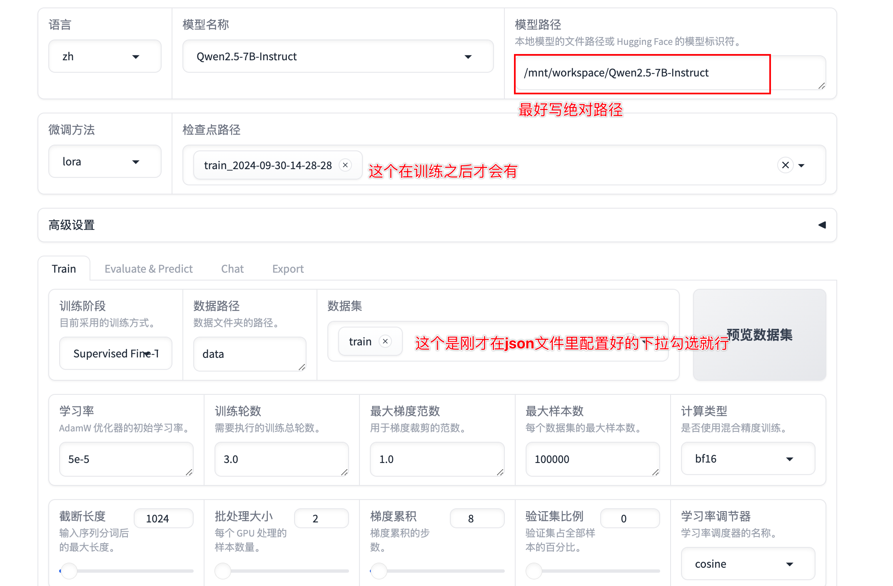
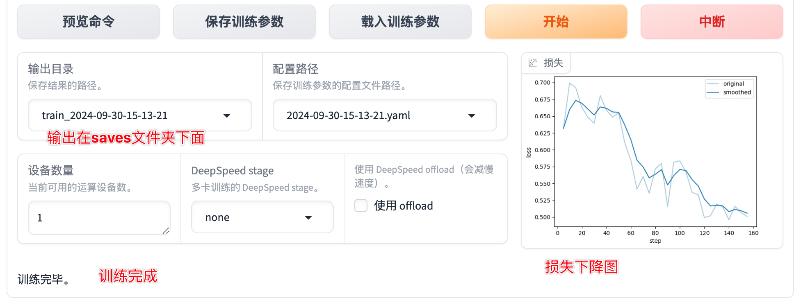
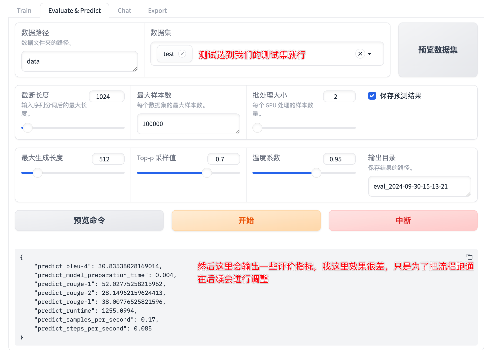

# Llamafactory_FT_Qwen
基于Llamaindex微调qwen2.5-7b


## 效果对比

利用刑法数据集微调后

存在问题：
每条回答基本都会带个前缀“根据提供的文本”，这里可能是生成数据中，有太多类似的回答造成了模型的过拟合。
## 1.数据集准备

下载需要处理的文本数据，最好转置为txt文件，然后使用bert模型进行chunk切分

切分后使用百炼的API调用大模型进行数据集构建

https://www.cnblogs.com/chentiao/p/17386131.html
https://blog.csdn.net/yierbubu1212/article/details/142635578?spm=1001.2014.3001.5502


当然你也可以直接下载我的数据集 
https://modelscope.cn/datasets/Dummyv07/Crimina_Law_Dataset/files
不用谢我 我叫雷锋
## 2.服务器搭建

由于算力限制选择阿里云服务器

https://free.aliyun.com/?spm=a2c4g.11174283.0.0.46a0527f6LNsEe&productCode=learn

https://help.aliyun.com/document_detail/2329850.html?spm=a2c4g.2261126.0.0.f3be1d2ddJscIy

## 3.Qwen2.5-7b

`!git lfs install` 记得下载lfs不然无法下载完整的模型文件

`!git clone https://www.modelscope.cn/Qwen/Qwen2.5-7B-Instruct.git`

## 4.Llamafactory

拉取环境

`!git clone https://github.com/hiyouga/LLaMA-Factory.git`

cd到Llamafactory目录下,加载依赖项
`!pip install -e .[torch,metrics]`

### 4.1加载数据

将转换好的.json数据放入Llamafactory中的data文件中，并修改配置文件data_set.json

``` python
  "train": {
    "file_name": "your_data_name.json"
  },
  "test": {
    "file_name": "your_data_name.json"
  }
```

### 4.2trian

cd到Llamafactory目录下 
`!llamafactory-cli webui` 启动webui界面


下拉找到训练就可以开始微调训练


---

- 参数配置
  
  train中的可选参数很多，这里先搁置不进行一一介绍，感兴趣的小伙伴可以自己先进行了解
  
### 4.3Evaluate & Predict




- 评价指标解释
  - predict_bleu-4 (30.835%):
    BLEU-4分数（BiLingual Evaluation Understudy）BLEU是衡量机器翻译或文本生成模型输出与参考答案相似度的常用指标。bleu-4表示计算了4-gram的匹配率，数值越高表示预测的文本质量越高。

  - predict_model_preparation_time (0.004秒):
    模型在进行预测前的准备时间，通常指模型加载和初始化的时间，单位是秒。数值越小表示准备时间越短。
  - predict_rouge-1 (52.03%):
    ROUGE-1是文本生成评价指标之一，它衡量生成文本与参考文本之间的1-gram重叠程度。rouge-1的数值越高，代表模型预测的词汇与参考答案越接近。
  - predict_rouge-2 (28.15%):
    ROUGE-2同样是ROUGE系列指标之一，衡量2-gram的重叠率。和ROUGE-1一样，数值越高，代表模型输出的文本与目标文本越接近。
  - predict_rouge-l (38.01%):
    ROUGE-L使用最长公共子序列（LCS）来衡量模型生成文本和参考文本之间的相似度。该指标更关注文本的顺序结构，数值越高代表输出文本在顺序上与参考答案更相似。
  - predict_runtime (1255.0994秒):
    这是模型进行预测所花费的总时间，单位为秒。该值通常会随模型复杂度、硬件配置以及数据集大小而变化。
  - predict_samples_per_second (0.17 样本/秒):
    这是模型每秒能够处理的样本数。值越高表示模型的处理效率越高。
  - predict_steps_per_second (0.085 步骤/秒):
    这是模型每秒执行的步骤（steps），每个步骤通常包括一次前向传播和梯度更新。数值越高，表示模型在预测过程中的计算效率越高。
### 4.4Export
（chat部分就是一个聊天界面，可以在线测试微调后的效果）
Export是将我们微调的模型进行导出，我的理解是(将训练好的lora部分和原本的模型进行合并)

这部分只用设置输出路径就可以进行导出了

## 5部署

## 5.1 Ollama部署

在服务器上部署

首先拉取ollma文件

`modelscope download --model=modelscope/ollama-linux --local_dir ./ollama-linux --revision v0.3.12`

新建创建 Modelfile 文件，写入

`FROM ./your_model_path`

- 在ollama文件中创建模型

`ollama create mymodel -f Modelfile`

- Llama.cpp

    如果在ollama创建模型文件的时候遇见 `Models based on 'Qwen2ForCausalLM' are not yet supported `的问题，可使用llama.cpp,导出gguf格式的文件再进行部署推理

    首先拉取llama.cpp文件

    `!git clone https://github.com/ggerganov/llama.cpp.git`

    ```python
    # 需要安装相关的库
    cd llama.cpp
    pip install -r requirements.txt
    # 验证环境
    python convert_hf_to_gguf.py -h

    # 使用脚本进行模型转换，可以选择量化方式
    python convert_hf_to_gguf.py ../yourmodelpath --outfile out_file_name.gguf --outtype f16
    ```
得到.gguf文件
然后重新使用`ollama create mymodel -f Modelfile`创建模型，Modelfile是一个指向文件，需要指到gguf文件的路径，还可以在里面配置一个模型参数。


此时出现模型输出不停止的情况
解决方式：
```python
#在modelfile文件中对大模型参数进行配置

FROM ./llama.cpp/qwen_7b_law.gguf

# set the temperature to 1 [higher is more creative, lower is more coherent]
PARAMETER temperature 0.7
PARAMETER top_p 0.8
PARAMETER repeat_penalty 1.05
PARAMETER top_k 20

TEMPLATE """{{ if .Messages }}
{{- if or .System .Tools }}<|im_start|>system
{{ .System }}
{{- if .Tools }}

# Tools

You are provided with function signatures within <tools></tools> XML tags:
<tools>{{- range .Tools }}
{"type": "function", "function": {{ .Function }}}{{- end }}
</tools>

For each function call, return a json object with function name and arguments within <tool_call></tool_call> XML tags:
<tool_call>
{"name": <function-name>, "arguments": <args-json-object>}
</tool_call>
{{- end }}<|im_end|>
{{ end }}
{{- range $i, $_ := .Messages }}
{{- $last := eq (len (slice $.Messages $i)) 1 -}}
{{- if eq .Role "user" }}<|im_start|>user
{{ .Content }}<|im_end|>
{{ else if eq .Role "assistant" }}<|im_start|>assistant
{{ if .Content }}{{ .Content }}
{{- else if .ToolCalls }}<tool_call>
{{ range .ToolCalls }}{"name": "{{ .Function.Name }}", "arguments": {{ .Function.Arguments }}}
{{ end }}</tool_call>
{{- end }}{{ if not $last }}<|im_end|>
{{ end }}
{{- else if eq .Role "tool" }}<|im_start|>user
<tool_response>
{{ .Content }}
</tool_response><|im_end|>
{{ end }}
{{- if and (ne .Role "assistant") $last }}<|im_start|>assistant
{{ end }}
{{- end }}
{{- else }}
{{- if .System }}<|im_start|>system
{{ .System }}<|im_end|>
{{ end }}{{ if .Prompt }}<|im_start|>user
{{ .Prompt }}<|im_end|>
{{ end }}<|im_start|>assistant
{{ end }}{{ .Response }}{{ if .Response }}<|im_end|>{{ end }}"""

# set the system message
SYSTEM """You are Qwen, created by Alibaba Cloud. You are a helpful assistant."""
```

- 最后使用ollama推理
`ollama run mymodel`


ollama常用指令：
```python
ollama serve # 启动ollama
ollama create # 从模型文件创建模型
ollama show  # 显示模型信息
ollama run  # 运行模型，会先自动下载模型
ollama pull  # 从注册仓库中拉取模型
ollama push  # 将模型推送到注册仓库
ollama list  # 列出已下载模型
ollama ps  # 列出正在运行的模型
ollama cp  # 复制模型
ollama rm  # 删除模型

```
